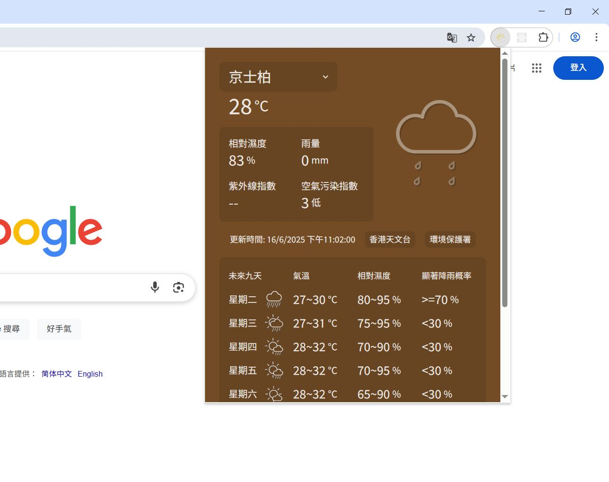

# Hong Kong Weather Now

A Chrome extension that lets you check the current weather in Hong Kong.

---

## Features

- Instantly view the latest weather for Hong Kong
- Simple, clean interface
- 9-day weather forecast
- Uses official government open data

---

## Screenshot

---

## Tech Stack

- HTML
- CSS
- JavaScript
- ReactJS
- Vite

---

## Data Source

Weather data is provided by the Hong Kong Government's open data platform.

---

## Installation & Usage

1. **Download** the ZIP file from the [releases page](#).
2. **Extract** the ZIP file.
3. In Chrome, go to `chrome://extensions/`.
4. Enable **Developer mode** (top right).
5. Click **Load unpacked** and select the extracted folder.
6. The extension is now ready to use!

---

## Font Used

This extension uses the **Chiron Hei HK (昭源黑體)** font.

- [Font details](https://chiron-fonts.github.io/)
- [Developer documentation](https://chiron-fonts.github.io/usage/webfont/)

The font is loaded via CDN for optimized performance and reduced extension size.

---

## Development

This project uses [Vite](https://vitejs.dev/) for fast development and hot module replacement.

### React + Vite

This template provides a minimal setup to get React working in Vite with HMR and some ESLint rules.

Currently, two official plugins are available:

- [@vitejs/plugin-react](https://github.com/vitejs/vite-plugin-react/blob/main/packages/plugin-react/README.md) (uses [Babel](https://babeljs.io/) for Fast Refresh)
- [@vitejs/plugin-react-swc](https://github.com/vitejs/vite-plugin-react-swc) (uses [SWC](https://swc.rs/) for Fast Refresh)

### Expanding the ESLint configuration

If you are developing a production application, we recommend using TypeScript and enabling type-aware lint rules. Check out the [TS template](https://github.com/vitejs/vite/tree/main/packages/create-vite/template-react-ts) to integrate TypeScript and [`typescript-eslint`](https://typescript-eslint.io) in your project.

---
